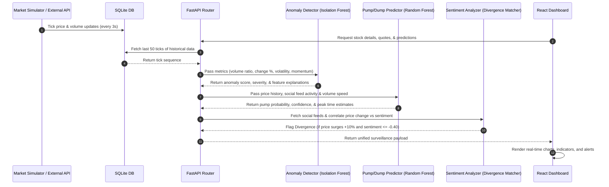
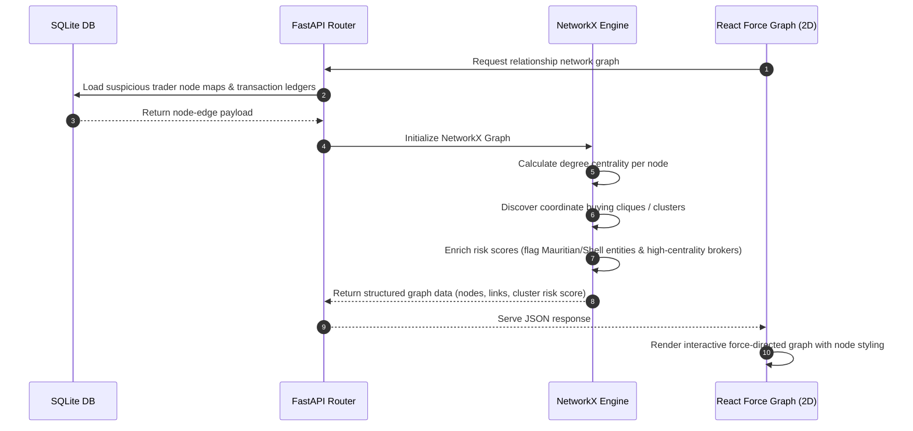

# MarketGuard AI — System Architecture & Workflow

This document outlines the detailed system architecture, component relationships, data flow pipelines, and the step-by-step workflow of **MarketGuard AI**—a SEBI/NSE-grade real-time market surveillance terminal designed for detecting anomalies, coordinate insider rings, and pump & dump schemes.

---

## 🏗️ High-Level System Architecture

MarketGuard AI uses a decoupled client-server architecture containing a **React Surveillance Dashboard**, a **FastAPI Microservice Backend**, and an **AI/ML and Graph Analytics Engine**. It is designed with a **Zero-Crash Resilience State Machine** that switches to offline simulation if the backend is unreachable.

### Visual System Architecture


### Component Relationship Diagram

```mermaid
flowchart TB
    %% Styling definitions
    classDef client fill:#1f2937,stroke:#3b82f6,stroke-width:2px,color:#fff;
    classDef client_state fill:#1e3a8a,stroke:#3b82f6,stroke-dasharray: 5 5,color:#fff;
    classDef backend fill:#111827,stroke:#10b981,stroke-width:2px,color:#fff;
    classDef ml fill:#312e81,stroke:#818cf8,stroke-width:2px,color:#fff;
    classDef db fill:#065f46,stroke:#34d399,stroke-width:2px,color:#fff;
    classDef external fill:#78350f,stroke:#f59e0b,stroke-width:1px,color:#fff;

    %% Client Tier
    subgraph Client [Client Tier - Browser]
        subgraph WebUI [React Surveillance Terminal]
            UI_Dash[Dashboard Dashboard.jsx]
            UI_Chart[Price Chart & TradingView PriceChart.jsx]
            UI_Graph[Insider Ring Visualization InsiderGraph.jsx]
            UI_XAI[Explainable AI Dashboard AIExplanation.jsx]
            UI_Controls[Demo Sequence Panel DemoControls.jsx]
        end

        subgraph ClientState [Client State & Offline Proxy]
            API_Client[API Gateway Client api.js]
            Resilience_SM[Zero-Crash Resilience State Machine]
            Fallback_DB[(Local Cache & Fallback Store fallbackData.js)]
        end
    end

    %% Web Services Gateway & Server Tier
    subgraph Server [Server Tier - FastAPI App]
        subgraph Routes [REST API Endpoints /routes]
            R_Stocks[stocks.py]
            R_Alerts[alerts.py]
            R_Graph[graph.py]
            R_Predict[prediction.py]
            R_Live[livestock.py]
            R_Quotes[quotes.py]
        end

        subgraph Workers [Background Processes]
            Simulator_T[Market Tick Simulator Thread simulator.py]
        end
    end

    %% Intelligence & Data Storage Tier
    subgraph Intel [Intelligence & Storage Tier]
        subgraph DB [Database Layer]
            ORM[SQLAlchemy ORM]
            SQLite[(SQLite DB marketguard.db)]
        end

        subgraph ML [AI/ML & Graph Models]
            AD[Anomaly Detector IsolationForest]
            PD[Pump & Dump Predictor RandomForest]
            NX[Insider Network Analyzer NetworkX]
            SA[Sentiment Analyzer Lexicon Matching]
        end
    end

    %% External Systems Tier
    subgraph External [External APIs Tier]
        AV_API[Alpha Vantage API / news & intraday]
        FH_API[Finnhub API / quotes & candles]
    end

    %% Connect WebUI to ClientState
    UI_Dash <--> API_Client
    UI_Chart <--> API_Client
    UI_Graph <--> API_Client
    UI_XAI <--> API_Client
    UI_Controls <--> API_Client
    
    API_Client <--> Resilience_SM
    Resilience_SM <-->|Fallback Active| Fallback_DB

    %% Connect Client Tier to Server Tier
    API_Client ===|REST over HTTP/JSON| Routes
    
    %% Connect Server Tier to Intel Tier
    Routes <--> ORM
    ORM <--> SQLite
    Simulator_T -->|Update Ticks & Transactions| SQLite

    %% Connect Routes to ML & Analytics
    R_Stocks --> AD
    R_Alerts --> AD
    R_Graph --> NX
    R_Predict --> PD
    R_Predict --> AD
    R_Predict --> SA
    R_Quotes --> SA

    %% Connect Server to External APIs
    R_Live <--> AV_API
    R_Live <--> FH_API
    R_Quotes <--> FH_API

    %% Class Application
    class UI_Dash,UI_Chart,UI_Graph,UI_XAI,UI_Controls client;
    class API_Client,Resilience_SM,Fallback_DB client_state;
    class R_Stocks,R_Alerts,R_Graph,R_Predict,R_Live,R_Quotes,Simulator_T backend;
    class AD,PD,NX,SA ml;
    class ORM,SQLite db;
    class AV_API,FH_API external;
```



---

## 🔄 Core Data Flow & Pipelines

The system executes parallel analytical pipelines whenever new market ticks or order book entries arrive. 

### Visual System Detection Workflow


```mermaid
flowchart TD
    %% Styling Definitions
    classDef user fill:#2563eb,stroke:#3b82f6,stroke-width:2px,color:#fff;
    classDef client fill:#1e293b,stroke:#475569,stroke-width:2px,color:#fff;
    classDef routing fill:#0d9488,stroke:#0f766e,stroke-dasharray: 5 5,color:#fff;
    classDef backend fill:#0f172a,stroke:#10b981,stroke-width:2px,color:#fff;
    classDef db fill:#16a34a,stroke:#15803d,stroke-width:2px,color:#fff;
    classDef ai fill:#6d28d9,stroke:#7c3aed,stroke-width:2px,color:#fff;

    %% Steps
    subgraph UserTier [1. User Interaction & Request Initiation]
        User[User Actions: Trigger Demo / Click Stock / Fetch Chart]
        UI[React Surveillance Dashboard]
        User -->|Interacts with UI| UI
    end

    subgraph ClientGateway [2. Client State & Gateway Routing]
        Axios[API Client Layer api.js]
        Proxy[Zero-Crash Proxy fallbackData.js]
        
        UI -->|Axios Request| Axios
        Axios -->|Network Offline?| Proxy
    end

    subgraph ServerRouter [3. FastAPI Routing & Background Ingestion]
        FastAPI[FastAPI Router main.py]
        Sim[Simulator Thread simulator.py]
        
        Axios -->|Network Online| FastAPI
    end

    subgraph Storage [4. Database & ORM Storage]
        DB[(SQLite marketguard.db)]
        FastAPI <-->|SQLAlchemy ORM Queries| DB
        Proxy <-->|Read fallbackData.js local variables| ProxyDB[(Local Cache Store)]
        Sim -->|Periodically Write Ticks every 3s| DB
    end

    subgraph AI_Engine [5. Multi-Model Surveillance Processing]
        AD[Anomaly Detection Outlier Scoring]
        PD[Pump & Dump Predictor Random Forest]
        NX[Insider Network Analyzer NetworkX]
        SA[Sentiment Analyzer Lexicon Matching]
        
        FastAPI & Proxy -->|Raw Price History & Feeds| AI_Engine
        AI_Engine --> AD
        AI_Engine --> PD
        AI_Engine --> NX
        AI_Engine --> SA
    end

    subgraph Aggregation [6. Results Aggregation & Response UI Rendering]
        Explain[Compile Explainable AI Diagnostic Logs]
        Alerts[Format Warning / Critical Security Alerts]
        
        AD & PD & NX & SA --> Explain & Alerts
        Explain & Alerts -->|JSON Response| UI
    end

    %% Class Assignments
    class User user;
    class UI client;
    class Axios,Proxy client;
    class FastAPI,Sim routing;
    class DB,ProxyDB db;
    class AD,PD,NX,SA ai;
```

### 1. Market Surveillance & ML Prediction Pipeline



### 2. Insider Ring Graph Analysis Pipeline



---

## 🎬 Demo Workflow: 12-Step Cinematic Sequence

The terminal features a scripted, automated scenario running on `IRFC_PENNY` to showcase how AI intercepts an active market manipulation sequence.

| Step | State | Event | Backend / Frontend Simulation Behavior |
| :--- | :--- | :--- | :--- |
| **Step 1** | Normal | **Baseline Set** | Establishes base price (~₹22.0) and normal volume ratios. |
| **Step 2** | Warning | **Volume Accumulation** | Daily volume spikes to 4x, showing early accumulator signs. |
| **Step 3** | Warning | **Price Momentum** | Momentum accelerates. Price jumps +19.1% on 15x normal volume. |
| **Step 4** | Warning | **Anomaly Alert (Vol)** | `Isolation Forest` flags `VOLUME_SURGE` anomaly warning (>0.70 score). |
| **Step 5** | Warning | **Anomaly Alert (Price)**| `Isolation Forest` flags `PRICE_SPIKE` anomaly warning (>0.70 score). |
| **Step 6** | Warning | **Public Hype** | Negative or warning social posts appear in sentiment feeds (Twitter/Reddit). |
| **Step 7** | Critical | **Sentiment Mismatch** | Sentiment drops to -0.89 while price surges, triggering **Sentiment Divergence**. |
| **Step 8** | Critical | **Insider Ring Found** | Graph shows Mauritian shells & synchronized trading nodes clearing block trades. |
| **Step 9** | Critical | **Explainable AI (XAI)** | Features weights update in real-time on dashboard, showing risk factors breakdown. |
| **Step 10** | Critical | **Pump & Dump Alert** | Random Forest flags `PUMP_DUMP` critical warning with high probability. |
| **Step 11** | Critical | **Peak Probability** | Prediction reaches terminal confidence of 96% and estimates peak time of ~3 mins. |
| **Step 12** | Resolved | **Retail Loss Prevented** | Displays green mitigation banner showing ₹4.2 Crore retail investor loss prevented. |

---

## 🧩 Key Subsystems Breakdown

### 1. AI/ML Module (`backend/` detectors)
* **Isolation Forest (`anomaly_detector.py`)**: Uses unsupervised learning to detect multi-dimensional trade outliers. Features used:
  1. `volume_ratio`: current volume vs average historical baseline
  2. `current_pct_change`: price fluctuation rate
  3. `volatility`: standard deviation of the last 5 ticks percentage changes
  4. `momentum`: price change rate over the last 5 ticks
* **Random Forest Classifier (`pump_dump_predictor.py`)**: A supervised classification model predicting coordinated pump & dump schemes based on price acceleration, volume speed, sentiment polarities, and social mention velocities.
* **Lexicon Sentiment (`sentiment_analyzer.py`)**: Keywords evaluation representing a highly optimized financial transformer (resembling FinBERT weight classes) for instant execution. Matches divergence anomalies between public sentiments and trading metrics.

### 2. Graph Surveillance Engine (`backend/insider_graph.py`)
* Operates on transaction maps using `NetworkX`.
* Detects cliques and highly connected sub-graphs.
* Performs **Degree Centrality** analyses to pinpoint critical hubs (e.g., clearing brokers or shell entities) funneling coordinated volume.

### 3. Failover Resilience (`frontend/src/services/api.js`)
* Implements a **Zero-Crash Resilience State Machine**.
* If the Axios client detects that the FastAPI backend server is offline, it activates **Resilience Mode** (setting `isOffline = true`).
* It redirects API requests to local state machines in `fallbackData.js`, running simulated tickers, demo sequences, and analytics computations in-browser so that the surveillance terminal remains operational.

---

## 🔌 API Endpoints Reference

All API routers are defined under `backend/routes/` and linked to the primary FastAPI gateway.

| Endpoint | Method | Description |
| :--- | :---: | :--- |
| `/api/stocks` | `GET` | Retrieves the list of tracked stocks with price, change %, and volume. |
| `/api/stocks/{symbol}` | `GET` | Retrieves detailed stock info along with 50-tick price/volume history. |
| `/api/alerts` | `GET` | Retrieves the feed of warnings and critical security alerts. |
| `/api/graph` | `GET` | Returns nodes and links for the insider transaction graph. |
| `/api/prediction/{symbol}` | `GET` | Returns prediction metrics, XAI factors, and anomaly evaluations. |
| `/api/live-stock/{symbol}` | `GET` | Initiates real-time external data streaming proxy (AlphaVantage/Finnhub). |
| `/api/quotes/quote/{symbol}` | `GET` | Fetches real-time price quotes. |
| `/api/quotes/candles/{symbol}`| `GET` | Fetches historical stock candles. |
| `/api/trigger-demo` | `POST` | Resets `IRFC_PENNY` simulation metrics and triggers Step 1. |
| `/api/set-demo-step/{step}`| `POST` | Directly forces the simulator to a specific step in the 12-step demo. |
| `/api/reset-demo` | `POST` | Re-seeds the system database back to fresh mock data baselines. |
