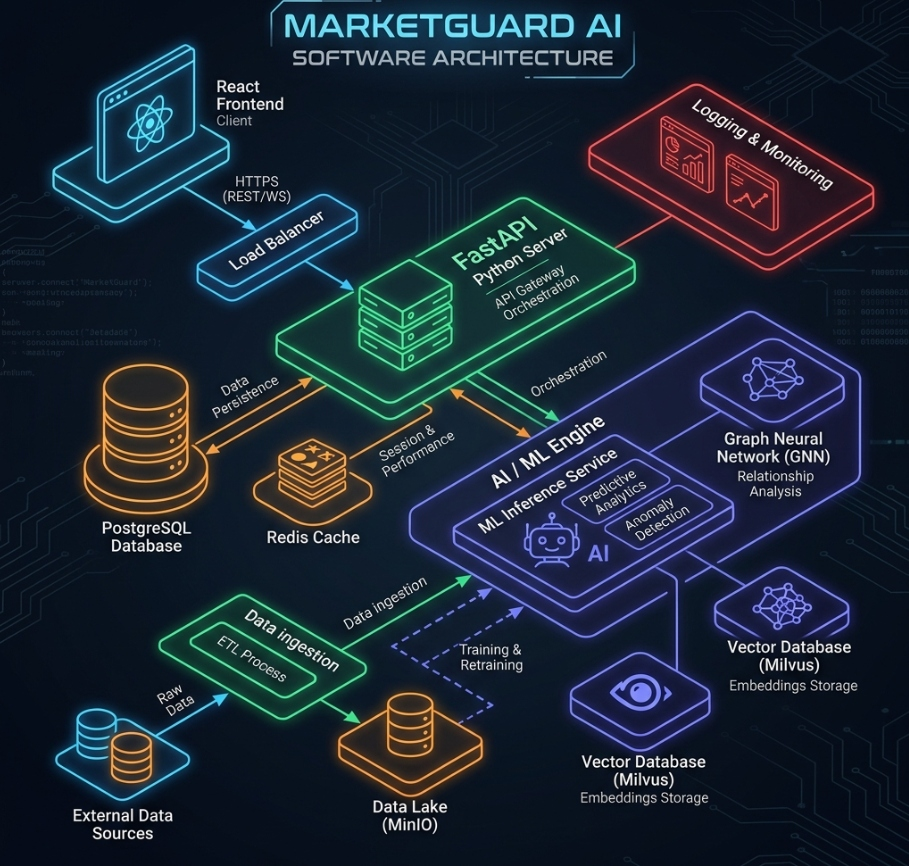

# 🛡️ MarketGuard AI — Real-Time Market Surveillance & Manipulation Detection Platform

**MarketGuard AI** is a SEBI/NSE-grade real-time market surveillance terminal designed to detect, track, and mitigate market manipulation, coordinate insider trading rings, and anomalous price movements. 

Combining unsupervised anomaly detection, graph-network correlation, and real-time news/social media sentiment analysis, it offers regulatory-tier protection for retail investors.

> [!IMPORTANT]
> This platform features a **Zero-Crash Resilience State Machine** (`fallbackData.js`). If the FastAPI backend microservice is offline, the surveillance terminal automatically activates local browser proxy simulation to maintain dashboard interactive features and complete the 12-step cinematic walkthrough sequence without crashing.

---

## 📖 Table of Contents
1. [🎯 Key Features](#-key-features)
2. [🏗️ Architecture & Component Flow](#%EF%B8%8F-architecture--component-flow)
3. [🛠️ Technology Stack](#%EF%B8%8F-technology-stack)
4. [📂 Directory Layout](#-directory-layout)
5. [🚀 Setup & Quickstart](#-setup--quickstart)
6. [📺 Interactive 12-Step Surveillance Walkthrough](#-interactive-12-step-surveillance-walkthrough)
7. [🧠 ML & Analytics Engines](#-ml--analytics-engines)

---

## 🎯 Key Features

*   **Outlier Detection (Isolation Forest)**: Real-time statistical analysis on volume ratio acceleration, price change rates, tick volatility, and momentum to detect market outliers.
*   **Predictive Intelligence (Random Forest)**: Supervised binary classifier flagging active pump-and-dump coordination schemes with calculated model confidence and estimated peak time.
*   **Coordinated Insider Rings (NetworkX)**: Graph-network analysis tracing transactions across clearing brokers, shell corporations (e.g., Mauritian shells), and coordinated trading groups to compute node degree-centrality.
*   **Sentiment Divergence Tracking**: Scrapes news & social feeds (Twitter/Reddit) and flags divergence alerts when stock price surges while public/regulatory sentiments drop sharply.
*   **Explainable AI (XAI)**: Detailed diagnostic explanations displaying precise weights of trade features contributing to warning/critical alerts.
*   **Resilience Failover State Machine**: Automatic front-end proxy failover keeping terminal functionality active even during complete backend service shutdowns.

---

## 🏗️ Architecture & Component Flow

### 1. Visual System Architecture
<<<<<<< HEAD


---

### 2. Core Platform Workflow (How it Works)

The system operates in **3 simple phases**:

#### Phase 1: Data Ingestion (Gathering Market Data)
*   **Step 1: Real-Time Ticking**: The system gets stock prices, volumes, and trade details every 3 seconds (either simulated or from external stock market APIs like AlphaVantage/Finnhub).
*   **Step 2: Database Storage**: All price ticks and transaction histories are saved directly in a local database (SQLite).

#### Phase 2: AI & ML Analysis (Spotting Fraud)
*   **Step 3: Anomaly Detection (Outliers)**: The system checks trade features (volume spikes, price jumps, momentum) using the **Isolation Forest** model to flag suspicious trades.
*   **Step 4: Predict Pump-and-Dump**: A **Random Forest** model estimates the probability of a coordinated pump-and-dump scheme.
*   **Step 5: Insider Trading Rings**: The system uses **NetworkX** to link traders, clearing brokers, and shell entities to locate coordinate buying clusters.
*   **Step 6: Sentiment Check**: The system scrapes feeds (Twitter/Reddit) to see if price is surging while public sentiment is negative (Divergence).

#### Phase 3: Dashboard Alerts (Visualizing Risks)
*   **Step 7: Explainable Logs**: The AI explains *why* it flagged a stock by highlighting the contributing risk factors (XAI).
*   **Step 8: UI Updates**: If the backend server goes offline, a **Resilience Proxy** takes over, ensuring the dashboard, charts, and 12-step demo keep working without crashing.

---

### 🔄 Core Platform Decision Flow (If-Else Logic)

Here is how the system decisions are evaluated at every tick:

#### 🌐 Connection Check
*   **Is Backend FastAPI Server Online?**
    *   👉 **YES** ➔ Routes requests directly to Python backend API endpoints.
    *   👉 **NO** ➔ Activates the Zero-Crash resilience proxy (`fallbackData.js`) to run simulated tickers and demo sequences in the browser.

#### 📊 Outlier Verification (Anomaly Detection)
*   **Does Anomaly Score Cross 0.70 Threshold?**
    *   👉 **YES** ➔ Checks if it exceeds 0.85:
        *   👉 **YES** ➔ Generates a **CRITICAL** risk alert on the dashboard.
        *   👉 **NO** ➔ Generates a **WARNING** alert on the dashboard.
    *   👉 **NO** ➔ Marks the stock status as **INFO** (Normal Trading Parameters).

#### 📈 Coordinated Scheme Check (Pump & Dump)
*   **Does RandomForest Classifier Predict > 60% Risk?**
    *   👉 **YES** ➔ Proceeds to:
        1. Calculate the estimated peak timeline (e.g., "3 mins remaining").
        2. Run network graphs to identify the pump operators.
        3. Display explainable risk factors on the screen.
    *   👉 **NO** ➔ Keeps monitoring news, volumes, and social counts in the background.

#### 🔗 Insider Network Clustering
*   **Are Multiple Traders Executing Coordinated Trades with High Centrality?**
    *   👉 **YES** ➔ Highlights the trader node cluster in **RED** and flags them as a "Coordinated Insider Ring".
    *   👉 **NO** ➔ Nodes remain **BLUE** (Individual Independent Traders).

#### 💬 Public Sentiment Alignment
*   **Is Stock Price Spiking while Public News Sentiment drops heavily?**
    *   👉 **YES** ➔ Triggers a **Sentiment Divergence Mismatch Alert** warning of potential operator manipulation.
    *   👉 **NO** ➔ Sentiment is aligned with price action; no alert is generated.
=======


---

### 2. Surveillance Detection Workflow


Below is the core automated sequence executed on every new market tick or stock price change:

```mermaid
flowchart TD
    A[Market Price/Volume Tick] --> B{Service Online?}
    B -->|Yes| C[FastAPI Server]
    B -->|No|  D[Local Proxy / fallbackData.js]

    C & D --> E[Isolation Forest Model]
    E -->|Analyze Volume Ratio & Volatility| F{Outlier Detected?}
    F -->|Yes| G[Flag Alert: Info/Warning/Critical]
    F -->|No| H[Normal Trade Parameters]

    C & D --> I[Random Forest Predictor]
    I -->|Correlate Social Mention Velocities| J{Pump & Dump Risk > 60%?}
    J -->|Yes| K[Predict Peak Time Window & Risk Score]
    J -->|No| L[Monitor Social Feeds]

    G & K --> M[NetworkX Insider Graph]
    M -->|Trace Trader Centrality & Shell Entities| N[Generate Coordinated Clique Report]
    
    N --> O[Explainable AI Diagnostic Logs]
    O --> P[Flash React Dashboard Alerts]
```
>>>>>>> 4cd17fd944f78ff2a44394e54786a64048f1a974

### 3. Core Data Pipelines
1. **The Ingestion Pipeline**: Market updates are fetched from external APIs (AlphaVantage & Finnhub) or ticked by the background simulator thread (`simulator.py`) and recorded in the SQLite database.
2. **The ML Analysis Pipeline**: The server runs the transaction features through the `IsolationForest` and `RandomForest` classifiers, producing normalized anomaly scores and prediction probabilities.
3. **The Graph Topology Pipeline**: Transactions are structured as an adjacency network in `NetworkX` to isolate clusters trading in synchronized patterns.
4. **The UI/Presentation Pipeline**: Data is serialized to JSON and pushed to the React Surveillance Console, where anomalies are mapped to force-directed layouts and explainable feature weight panels.

For comprehensive details on routers, models, and endpoints, see the main [ARCHITECTURE.md](file:///c:/Users/Lokesh sri surya/project/hackathon/ARCHITECTURE.md) document.

---

## 🛠️ Technology Stack

*   **Frontend**: React.js, TailwindCSS (Surveillance Dark Theme), Recharts, react-force-graph-2d, Axios
*   **Backend**: Python, FastAPI, SQLAlchemy ORM, Uvicorn
*   **Database**: SQLite (local database seeder)
*   **AI/ML & Analytics**: Scikit-Learn (Isolation Forest, Random Forest Classifiers), NetworkX (Graph Algorithms), Pandas, NumPy

---

## 📂 Directory Layout

```
├── backend/
│   ├── routes/                # FastAPI endpoint sub-routers (stocks, alerts, prediction, etc.)
│   ├── utils/
│   │   └── simulator.py       # Background simulation thread generating 3s market ticks
│   ├── alpha_service.py       # API client for Alpha Vantage integration
│   ├── finnhub_service.py     # API client for Finnhub quotes and candles
│   ├── anomaly_detector.py    # Isolation Forest statistical anomaly scorer
│   ├── pump_dump_predictor.py # Random Forest pump-and-dump probability classifier
│   ├── insider_graph.py       # NetworkX clique & centrality generator
│   ├── sentiment_analyzer.py  # News & social feedback keyword analysis
│   ├── database.py            # SQLAlchemy database connector
│   ├── models.py              # SQLAlchemy database declarations
│   ├── requirements.txt       # Python environment dependencies
│   └── main.py                # Main backend entrypoint & background scheduler
├── frontend/
│   ├── src/
│   │   ├── components/        # Dashboard layout, charts, force-directed graph UI panels
│   │   ├── services/
│   │   │   ├── api.js         # API gateway client & failover switch
│   │   │   └── fallbackData.js# Offline local simulation data store
│   │   ├── App.jsx            # React root component
│   │   └── index.css          # Tailwind variables and terminal dark theme
│   └── package.json           # npm manifest
├── ARCHITECTURE.md            # Detailed system design schemas and diagrams
└── README.md                  # Project overview and setup documentation
```

---

## 🚀 Setup & Quickstart

### Prerequisites
*   Python 3.8 or higher
*   Node.js v16 or higher & npm

---

### Step 1: Initialize the Backend Server

1. Open a terminal and navigate to the project root directory:
   ```bash
   cd c:/Users/Lokesh sri surya/project/hackathon
   ```
2. Install the required Python packages:
   ```bash
   pip install -r backend/requirements.txt
   ```
3. Run the FastAPI development server:
   ```bash
   python backend/main.py
   ```
   *The server starts on `http://localhost:8000`. On startup, it seeds initial stocks/alerts and initializes a daemon thread ticking prices every 3 seconds.*

---

### Step 2: Initialize the Frontend Dashboard

1. Open a new terminal window/tab and navigate to the `frontend/` directory:
   ```bash
   cd c:/Users/Lokesh sri surya/project/hackathon/frontend
   ```
2. Install npm dependencies:
   ```bash
   npm install
   ```
3. Start the Vite local development server:
   ```bash
   npm run dev
   ```
   *The React surveillance terminal will serve on `http://localhost:5173/`.*

---

## 📺 Interactive 12-Step Surveillance Walkthrough

To view the platform’s real-time interception capabilities, trigger the **Coordinated Pump & Dump Scenario** from the floating controller panel:

1.  **Step 1: Normal Baseline** — Stable trading behavior on `IRFC_PENNY` (Price ~₹22.0).
2.  **Step 2: Volume Surge** — Daily trading volume spikes 4x with no corporate announcements.
3.  **Step 3: Price Acceleration** — Momentum triggers price growth of +19.1% on 15x normal volume.
4.  **Step 4: Isolation Forest (Vol)** — Outlier scoring detects volume anomalies (>0.70 score).
<<<<<<< HEAD
5.  **Step 5: Isolation Forest (Price)** — Outlier scoring flags a price surge warning (>0.70 score).
6.  **Step 6: Hype Spreading** — Online forum posts (Twitter/Reddit) trigger increased social alerts.
7.  **Step 7: Sentiment Mismatch** — Sentiment scores drop to -0.89 while price rises, indicating a divergence mismatch.
8.  **Step 8: Insider Cluster Analysis** — NetworkX maps a central Mauritian shell broker node loop.
9.  **Step 9: Explainable AI** — Dashboard parses model weights showing exact contributors.
10. **Step 10: Random Forest Classification** — Predictive probability scores cross 90%+ risk.
11. **Step 11: Window Calculation** — Predictive engine sets a peak estimate window (e.g., 3 mins).
12. **Step 12: Resolution** — Mitigation actions complete. Protection banner registers **₹4.2 Crore** prevented retail losses.
=======
5.  **Step 6: Hype Spreading** — Online forum posts (Twitter/Reddit) trigger increased social alerts.
6.  **Step 7: Sentiment Mismatch** — Sentiment scores drop to -0.89 while price rises, indicating a divergence mismatch.
7.  **Step 8: Insider Cluster Analysis** — NetworkX maps a central Mauritian shell broker node loop.
8.  **Step 9: Explainable AI** — Dashboard parses model weights showing exact contributors.
9.  **Step 10: Random Forest Classification** — Predictive probability scores cross 90%+ risk.
10. **Step 11: Window Calculation** — Predictive engine sets a peak estimate window (e.g., 3 mins).
11. **Step 12: Resolution** — Mitigation actions complete. Protection banner registers **₹4.2 Crore** prevented retail losses.
>>>>>>> 4cd17fd944f78ff2a44394e54786a64048f1a974

*Note: You can click the **Reset Demo** button at any point to restore databases to default baselines.*

---

## 🧠 ML & Analytics Engines

| Engine / Component | Model / Tool | Applied Logic | Outputs |
| :--- | :--- | :--- | :--- |
| **Outlier Detection** | Scikit-Learn `IsolationForest` | Evaluates volume ratios, price delta, standard deviation of changes, and momentum trends. | Outlier score (0.00-1.00), Severity (INFO/WARN/CRITICAL), XAI explanations. |
| **Prediction Models** | Scikit-Learn `RandomForest` | Trained on coordinate pump vectors (spikes, high velocity social mentions, negative news). | Probability of pump-and-dump schemes, confidence levels, minutes to peak. |
| **Coordinated Rings** | NetworkX | Analyzes relationship trees between clearing brokers, traders, and known shell organizations. | Suspicious cliques, node degree centralities, cluster risk ratings. |
| **News Sentiment** | Lexicon Dictionary | Scans incoming keywords (`multibagger`, `losses`, `sebi`, `npa`) to compute valence ratings. | Positive/negative/neutral classifications, sentiment score (-1.00 to +1.00). |

---

> [!TIP]
> For questions about the data pipelines or to extend surveillance metrics, check the detailed class blueprints in [backend/anomaly_detector.py](file:///c:/Users/Lokesh%20sri%20surya/project/hackathon/backend/anomaly_detector.py) and [backend/pump_dump_predictor.py](file:///c:/Users/Lokesh%20sri%20surya/project/hackathon/backend/pump_dump_predictor.py).
